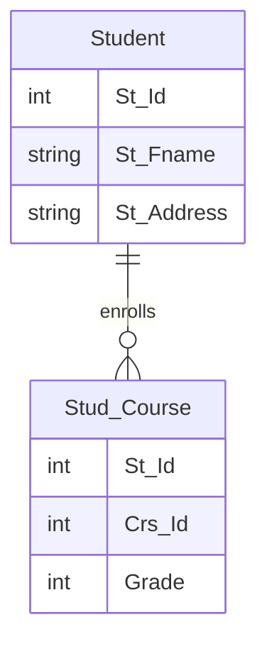

# Joins with DML: Update Operation Example

## Understanding Joins with DML

While joins are commonly used with SELECT statements, they can also be powerful when combined with Data Manipulation Language (DML) operations like UPDATE, INSERT, and DELETE. This allows us to modify data in one table based on conditions or values from another table.

## Tables Involved

We'll be working with two main tables:

1. **Student** table
   - Contains student information (St_Id, St_Fname, St_Address, etc.)

2. **Stud_Course** table
   - Contains student course information (St_Id, Crs_Id, Grade)

## Visual Representation



## Join with SELECT (for reference)

Before performing the update, we might want to see the data we're going to modify:

```sql
SELECT S.St_Fname, S.St_Address, SC.Grade
FROM Student S, Stud_Course SC
WHERE S.St_Id = SC.St_Id AND S.St_Address = 'Alex'
```

This query shows students who are enrolled in courses and live in Alexandria.

## Join with UPDATE

Now, let's update the grades of students living in Alexandria by increasing them by 10%:

```sql
UPDATE SC
SET Grade = Grade * 1.1
FROM Student S, Stud_Course SC
WHERE S.St_Id = SC.St_Id AND S.St_Address = 'Alex'
```

## Key Points

1. The UPDATE statement modifies data in the Stud_Course table (SC).
2. The join with the Student table (S) allows us to apply a condition based on the student's address.
3. Only grades for students living in Alexandria will be updated.
4. The grade increase is calculated by multiplying the current grade by 1.1 (which is equivalent to adding 10%).

## Before and After Example

Let's visualize how this update might affect our data:

| Before Update |           | After Update |           |
|---------------|-----------|--------------|-----------|
| Student       | Grade     | Student      | Grade     |
| Ahmed (Alex)  | 100       | Ahmed (Alex) | 110       |
| Mona (Cairo)  | 90        | Mona (Cairo) | 90        |
| Khalid (Alex) | 80        | Khalid (Alex)| 88        |

Note that Mona's grade doesn't change because she doesn't live in Alexandria.

## Considerations

- Ensure you have appropriate permissions to update the table.
- Consider using transactions for safety, especially when updating large amounts of data.
- Always test your update query with a SELECT statement first to ensure you're targeting the correct rows.
- Be cautious with updates based on joins, as they can affect many rows at once.

## Advanced Usage

You can extend this concept to more complex scenarios:
- Updating based on multiple conditions from multiple joined tables
- Using subqueries in your update statement
- Applying different update logic based on conditions from joined tables


### Execution Order

The execution order of the UPDATE statement is as follows:

1. FROM clause: Tables are accessed
2. JOIN: Tables are joined (if using INNER JOIN syntax)
3. WHERE: Filtering conditions are applied
4. UPDATE: The specified columns are updated

## DELETE Operation

Deleting rows from a table based on conditions in another table:

```sql
DELETE SC
FROM Stud_Course SC
INNER JOIN Student S ON S.St_Id = SC.St_Id
WHERE S.St_Address = 'Cairo'
```

This query deletes all course records for students living in Cairo.

## INSERT Operation

Inserting data into a table based on data from another table:

```sql
INSERT INTO Stud_Course (St_Id, Crs_Id, Grade)
SELECT S.St_Id, 101, 0
FROM Student S
WHERE S.St_Address = 'Alex' AND S.St_Id NOT IN (SELECT St_Id FROM Stud_Course WHERE Crs_Id = 101)
```

This query enrolls all students from Alexandria into a course with ID 101 if they're not already enrolled.

## Key Points

1. Joins in DML operations allow you to modify data based on related information in other tables.
2. The execution order is important: FROM/JOIN, WHERE, then the DML operation.
3. Always test your DML statements with SELECT queries first to ensure you're targeting the correct rows.

## Considerations

- Use transactions for safety, especially when modifying large amounts of data.
- Ensure you have appropriate permissions on all involved tables.
- Be cautious with joins in DML operations, as they can affect many rows at once.

## Advanced Usage

- Subqueries: You can use subqueries in your DML statements for more complex operations.
- Multiple Joins: You can join more than two tables in a single DML operation.
- Conditional Updates: Use CASE statements for more complex update logic.

## Example: Complex UPDATE

```sql
UPDATE SC
SET Grade = CASE 
    WHEN S.St_Address = 'Cairo' THEN Grade * 1.1
    WHEN S.St_Address = 'Alex' THEN Grade * 1.05
    ELSE Grade
END
FROM Stud_Course SC
INNER JOIN Student S ON S.St_Id = SC.St_Id
```

This query applies different grade increases based on the student's address.
