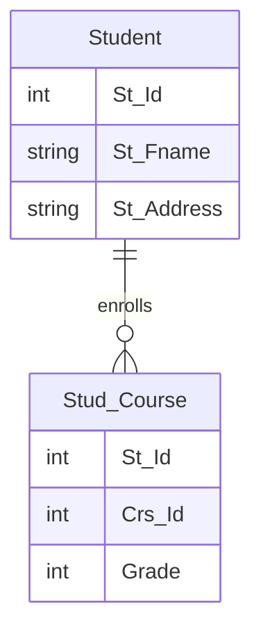

# Joins with DML: Update Operation Example

## Understanding Joins with DML

While joins are commonly used with SELECT statements, they can also be powerful when combined with Data Manipulation Language (DML) operations like UPDATE, INSERT, and DELETE. This allows us to modify data in one table based on conditions or values from another table.

## Tables Involved

We'll be working with two main tables:

1. **Student** table
   - Contains student information (St_Id, St_Fname, St_Address, etc.)

2. **Stud_Course** table
   - Contains student course information (St_Id, Crs_Id, Grade)

## Visual Representation



## Join with SELECT (for reference)

Before performing the update, we might want to see the data we're going to modify:

```sql
SELECT S.St_Fname, S.St_Address, SC.Grade
FROM Student S, Stud_Course SC
WHERE S.St_Id = SC.St_Id AND S.St_Address = 'Alex'
```

This query shows students who are enrolled in courses and live in Alexandria.

## Join with UPDATE

Now, let's update the grades of students living in Alexandria by increasing them by 10%:

```sql
UPDATE SC
SET Grade = Grade * 1.1
FROM Student S, Stud_Course SC
WHERE S.St_Id = SC.St_Id AND S.St_Address = 'Alex'
```

## Key Points

1. The UPDATE statement modifies data in the Stud_Course table (SC).
2. The join with the Student table (S) allows us to apply a condition based on the student's address.
3. Only grades for students living in Alexandria will be updated.
4. The grade increase is calculated by multiplying the current grade by 1.1 (which is equivalent to adding 10%).

## Before and After Example

Let's visualize how this update might affect our data:

| Before Update |           | After Update |           |
|---------------|-----------|--------------|-----------|
| Student       | Grade     | Student      | Grade     |
| Ahmed (Alex)  | 100       | Ahmed (Alex) | 110       |
| Mona (Cairo)  | 90        | Mona (Cairo) | 90        |
| Khalid (Alex) | 80        | Khalid (Alex)| 88        |

Note that Mona's grade doesn't change because she doesn't live in Alexandria.

## Considerations

- Ensure you have appropriate permissions to update the table.
- Consider using transactions for safety, especially when updating large amounts of data.
- Always test your update query with a SELECT statement first to ensure you're targeting the correct rows.
- Be cautious with updates based on joins, as they can affect many rows at once.

## Advanced Usage

You can extend this concept to more complex scenarios:
- Updating based on multiple conditions from multiple joined tables
- Using subqueries in your update statement
- Applying different update logic based on conditions from joined tables


### Execution Order

The execution order of the UPDATE statement is as follows:

1. FROM clause: Tables are accessed
2. JOIN: Tables are joined (if using INNER JOIN syntax)
3. WHERE: Filtering conditions are applied
4. UPDATE: The specified columns are updated

## DELETE Operation

Deleting rows from a table based on conditions in another table:

```sql
DELETE SC
FROM Stud_Course SC
INNER JOIN Student S ON S.St_Id = SC.St_Id
WHERE S.St_Address = 'Cairo'
```

This query deletes all course records for students living in Cairo.

## INSERT Operation

Inserting data into a table based on data from another table:

```sql
INSERT INTO Stud_Course (St_Id, Crs_Id, Grade)
SELECT S.St_Id, 101, 0
FROM Student S
WHERE S.St_Address = 'Alex' AND S.St_Id NOT IN (SELECT St_Id FROM Stud_Course WHERE Crs_Id = 101)
```

This query enrolls all students from Alexandria into a course with ID 101 if they're not already enrolled.

## Key Points

1. Joins in DML operations allow you to modify data based on related information in other tables.
2. The execution order is important: FROM/JOIN, WHERE, then the DML operation.
3. Always test your DML statements with SELECT queries first to ensure you're targeting the correct rows.

## Considerations

- Use transactions for safety, especially when modifying large amounts of data.
- Ensure you have appropriate permissions on all involved tables.
- Be cautious with joins in DML operations, as they can affect many rows at once.

## Advanced Usage

- Subqueries: You can use subqueries in your DML statements for more complex operations.
- Multiple Joins: You can join more than two tables in a single DML operation.
- Conditional Updates: Use CASE statements for more complex update logic.

## Example: Complex UPDATE

```sql
UPDATE SC
SET Grade = CASE 
    WHEN S.St_Address = 'Cairo' THEN Grade * 1.1
    WHEN S.St_Address = 'Alex' THEN Grade * 1.05
    ELSE Grade
END
FROM Stud_Course SC
INNER JOIN Student S ON S.St_Id = SC.St_Id
```

This query applies different grade increases based on the student's address.


# Aggregate Functions in Databases: 

## Introduction to Database Functions

Database functions are reusable code blocks that perform specific tasks within a database system. They help maintain code efficiency and reduce repetition. Functions in databases are categorized into two main types:

1. User-Defined Functions (UDFs)
2. Built-in Functions

## Aggregate Functions

Aggregate functions are a type of built-in function that perform calculations on a set of values and return a single result. They are also known as scalar functions because they return a single (scalar) value.

## 1. The COUNT() Function

COUNT() is one of the most commonly used aggregate functions. It is used to count the number of rows that match specified criteria.

### Syntax and Usage

COUNT() can be used with different arguments:

1. COUNT(*)
2. COUNT(column_name)

Let's explore these using the following example table:

| Eid | Ename    | Salary | Address   | did |
|-----|----------|--------|-----------|-----|
| 1   | ahmed    | 3000   | cairo     | 10  |
| 2   | ali      | 5000   | cairo     | 10  |
| ...   | ...    | ...    | ...       | ... |
| 15  | omar     | NULL   | mansoura  | 30  |

### COUNT(*) - Counting All Rows

```sql
SELECT COUNT(*)
FROM Employees
```

This query returns the total number of rows in the table, including rows with NULL values in any column.

Result: 15 (total number of rows)

### COUNT(column_name) - Counting Non-NULL Values

```sql
SELECT COUNT(Eid)
FROM Employees
```

This query counts the number of non-NULL values in the Eid column.

Result: 15 (assuming Eid is the primary key and has no NULL values)

```sql
SELECT COUNT(Salary)
FROM Employees
```

This query counts the number of non-NULL values in the Salary column.

Result: 14 (one employee has a NULL salary)

## Key Points about COUNT()

1. COUNT(*) includes all rows, regardless of NULL values.
2. COUNT(column_name) only counts non-NULL values in the specified column.
3. COUNT() always returns a single value, making it a scalar function.
4. It's often used with GROUP BY to count occurrences within groups.

## Example: Counting Employees by Department

```sql
SELECT did, COUNT(*) AS EmployeeCount
FROM Employees
GROUP BY did
```

This query would return the number of employees in each department.

## Considerations

- Performance: COUNT(*) is generally faster than COUNT(column_name) when counting all rows.
- NULL handling: Be aware of how NULL values affect your count when using column names.
- Combining with other clauses: COUNT() can be used with WHERE, HAVING, and other SQL clauses for more complex queries.


## 2. SUM() Function

The SUM() function calculates the total sum of a set of values.

### Syntax and Usage
```sql
SELECT SUM(column_name)
FROM table_name
```

### Example
```sql
SELECT SUM(Salary) AS TotalSalary
FROM Employees
```
This query returns the total sum of all salaries.

### Key Points
- Takes one parameter: a column name of numeric type
- Ignores NULL values in the calculation

## 3. AVG() Function

The AVG() function calculates the average value of a set of values.

### Syntax and Usage
```sql
SELECT AVG(column_name)
FROM table_name
```

### Example
```sql
SELECT AVG(Salary) AS AverageSalary
FROM Employees
```
This query returns the average salary of all employees.

### Key Points
- Takes one parameter: a column name of numeric type
- Equivalent to SUM(column) / COUNT(column)
- Ignores NULL values in the calculation

## 4. MAX() Function

The MAX() function returns the maximum value in a set of values.

### Syntax and Usage
```sql
SELECT MAX(column_name)
FROM table_name
```

### Example
```sql
SELECT MAX(Salary) AS HighestSalary
FROM Employees
```
This query returns the highest salary among all employees.

## 5. MIN() Function

The MIN() function returns the minimum value in a set of values.

### Syntax and Usage
```sql
SELECT MIN(column_name)
FROM table_name
```

### Example
```sql
SELECT MIN(Salary) AS LowestSalary
FROM Employees
```
This query returns the lowest salary among all employees.

## Combined Usage

These functions can be used together in a single query:

```sql
SELECT 
    COUNT(*) AS TotalEmployees,
    SUM(Salary) AS TotalSalary,
    AVG(Salary) AS AverageSalary,
    MAX(Salary) AS HighestSalary,
    MIN(Salary) AS LowestSalary
FROM Employees
```

## Key Points about Aggregate Functions

1. They return a single value based on a set of rows.
2. The returned value is calculated and may not exist in the original data.
3. They ignore NULL values (except COUNT(*)).
4. They are often used with GROUP BY for more complex analyses.

## Examples with Different Tables

```sql
-- Count of students
SELECT COUNT(*) AS CountOfStudents
FROM Student

-- Count of students with age value
SELECT COUNT(St_Age) AS CountOfStudentsHavingAgeValue 
FROM Student

-- Sum of instructor salaries
SELECT SUM(Salary) AS SumOfSalary
FROM Instructor

-- Average instructor salary
SELECT AVG(Salary) AS AverageSalary
FROM Instructor

-- Highest and lowest instructor salaries
SELECT MAX(Salary) AS MaxSalary, MIN(Salary) AS MinSalary
FROM Instructor
```

These examples demonstrate how aggregate functions can be applied to different tables and scenarios in a database.


# Understanding GROUP BY in SQL with Aggregate Functions

## Introduction to GROUP BY

The GROUP BY clause in SQL is used to group rows that have the same values in specified columns. It's often used with aggregate functions to perform calculations on each group of rows.

## Basic Usage with Aggregate Functions

Let's consider the Instructor table:

| Ins_Id | Ins_Name | Ins_Degree | Salary     | Dept_Id |
|--------|----------|------------|------------|---------|
| 1      | Ahmed    | Master     | 34567.0000 | 10      |
| 2      | Hany     | Master     | 323423.0000| 10      |
| ...    | ...      | ...        | ...        | ...     |
| 15     | Ghada    | NULL       | NULL       | 40      |

### Without GROUP BY

```sql
SELECT MIN(Salary) AS MinSalary
FROM Instructor
```
This query returns the lowest salary across all departments.

### With GROUP BY

```sql
SELECT Dept_Id, MIN(Salary) AS MinSalary
FROM Instructor
GROUP BY Dept_Id
```
This query returns the lowest salary for each department.

## Visual Representation of Grouping

Consider the Employees table:

| Eid | Ename    | Salary | Address   | did |
|-----|----------|--------|-----------|-----|
| 1   | ahmed    | 3000   | cairo     | 10  |
| 2   | ali      | 5000   | cairo     | 10  |
| ... | ...      | ...    | ...       | ... |
| 15  | omar     | 3000   | mansoura  | 30  |

When we use GROUP BY, we're essentially dividing the table into subtables or groups based on the specified column(s):

```
Employees (3 Groups based on 'did')
┌─────────────────┐  ┌─────────────────┐  ┌─────────────────┐
│  Department 10  │  │  Department 20  │  │  Department 30  │
├─────────────────┤  ├─────────────────┤  ├─────────────────┤
│ ahmed   3000    │  │ mohamed  6000   │  │ sayed   8000    │
│ ali     5000    │  │ alaa     7000   │  │ reham   1500    │
│ eman    2000    │  │ ola      4000   │  │ sally   2000    │
│ khalid  1000    │  │ reem     2000   │  │ omar    3000    │
│ yousef  4000    │  │ nada     9000   │  └─────────────────┘
│ sameh   5000    │  └─────────────────┘
└─────────────────┘
```

## Key Points about GROUP BY

1. GROUP BY is used with columns containing repeated values.
2. It's not logical to use GROUP BY with a primary key or unique column.
3. Aggregate functions (like MIN, MAX, AVG, SUM, COUNT) are applied to each group separately.
4. Columns in the SELECT statement must either be in the GROUP BY clause or be used with an aggregate function.

## Example Queries

```sql
-- Average salary per department
SELECT Dept_Id, AVG(Salary) AS AvgSalary
FROM Instructor
GROUP BY Dept_Id

-- Count of employees per department
SELECT did, COUNT(*) AS EmployeeCount
FROM Employees
GROUP BY did

-- Total salary per address
SELECT Address, SUM(Salary) AS TotalSalary
FROM Employees
GROUP BY Address
```

## Considerations

- GROUP BY comes after the WHERE clause but before ORDER BY in a SQL statement.
- You can group by multiple columns: `GROUP BY column1, column2, ...`
- When using GROUP BY, ensure that non-aggregated columns in the SELECT list are included in the GROUP BY clause.


# GROUP BY with COUNT and HAVING Clause in SQL

## Grouping Students by Department

To group students by their department and count the number of students in each department, we can use the GROUP BY clause with the COUNT function.

### Basic Query

```sql
SELECT Dept_Id, COUNT(*) AS CountOfStudentsPerDepartment 
FROM Student 
GROUP BY Dept_Id
```

This query will:
1. Group all students by their Dept_Id
2. Count the number of students in each group
3. Display the Dept_Id and the count for each group

## Filtering Before Grouping (WHERE Clause)

If we want to exclude students who are not assigned to any department:

```sql
SELECT Dept_Id, COUNT(*) AS CountOfStudentsPerDepartment 
FROM Student 
WHERE Dept_Id IS NOT NULL
GROUP BY Dept_Id
```

This query:
1. Filters out students with NULL Dept_Id before grouping
2. Groups the remaining students by Dept_Id
3. Counts and displays the results

## Filtering After Grouping (HAVING Clause)

To add a condition on the grouped results, we use the HAVING clause:

```sql
SELECT Dept_Id, COUNT(*) AS CountOfStudentsPerDepartment 
FROM Student 
WHERE Dept_Id IS NOT NULL
GROUP BY Dept_Id 
HAVING COUNT(*) > 3
```

This query:
1. Filters out students with NULL Dept_Id
2. Groups students by Dept_Id
3. Counts students in each group
4. Only displays groups with more than 3 students

## Key Points

1. **WHERE vs HAVING:**
   - WHERE filters rows before grouping
   - HAVING filters grouped results after grouping

2. **Order of Clauses:**
   ```
   SELECT ... FROM ... WHERE ... GROUP BY ... HAVING ... ORDER BY ...
   ```

3. **HAVING with Aggregate Functions:**
   - HAVING is typically used with aggregate functions (COUNT, SUM, AVG, etc.)
   - It can reference aliases defined in the SELECT clause

4. **Performance Considerations:**
   - Use WHERE for filtering individual rows when possible
   - Use HAVING only for conditions that involve aggregate results

## Examples

1. Average age of students by department, excluding departments with less than 5 students:
   ```sql
   SELECT Dept_Id, AVG(Age) AS AvgAge, COUNT(*) AS StudentCount
   FROM Student
   GROUP BY Dept_Id
   HAVING COUNT(*) >= 5
   ```

2. Total scholarships by department, only for departments with total scholarships over $10,000:
   ```sql
   SELECT Dept_Id, SUM(Scholarship) AS TotalScholarship
   FROM Student
   WHERE Scholarship IS NOT NULL
   GROUP BY Dept_Id
   HAVING SUM(Scholarship) > 10000
   ```

Remember, the power of GROUP BY comes from its ability to summarize data, and when combined with WHERE and HAVING, it provides a robust tool for data analysis in SQL.

# GROUP BY with Multiple Columns in SQL

## Introduction

When grouping data in SQL, we can use multiple columns in the GROUP BY clause to create more specific groups. This is particularly useful when we want to analyze data at a more granular level.

## Basic Query Structure

```sql
SELECT Dept_Id, St_Address, COUNT(*) AS CountOfStudentsPerDepartment
FROM Student 
WHERE Dept_Id IS NOT NULL AND St_Address IS NOT NULL
GROUP BY Dept_Id, St_Address
```

## How Multiple Column Grouping Works

When grouping by multiple columns, SQL creates distinct groups for each unique combination of the specified columns.

### Visual Representation:

```
DepartmentId, St_Address
10           Cairo       = 3
10           Alex        = 2
10           NULL        = 9
20           Cairo       = 0
20           Alex        = 1
20           NULL        = 3
30           Cairo       = 4
30           Alex        = 0
30           NULL        = 10
NULL         Cairo       = 3
NULL         Alex        = 2
NULL         NULL        = 9
```

## Key Points

1. **Column Selection**: Any non-aggregated column in the SELECT clause must appear in the GROUP BY clause.

2. **Order of Columns**: The order of columns in the GROUP BY clause doesn't affect the result, but it may affect the order of the output rows.

3. **NULL Handling**: NULL values are treated as a distinct group unless filtered out in the WHERE clause.

4. **Filtering**: Use WHERE to filter rows before grouping, and HAVING to filter groups after grouping.

## Examples

### Basic Grouping
```sql
SELECT Dept_Id, St_Address, COUNT(*) AS CountOfStudentsPerDepartment
FROM Student 
WHERE Dept_Id IS NOT NULL 
GROUP BY Dept_Id, St_Address
```

### Filtering NULL Addresses
```sql
SELECT Dept_Id, St_Address, COUNT(*) AS CountOfStudentsPerDepartment
FROM Student 
WHERE Dept_Id IS NOT NULL AND St_Address IS NOT NULL
GROUP BY Dept_Id, St_Address
```

### Adding a HAVING Clause
```sql
SELECT Dept_Id, St_Address, COUNT(*) AS CountOfStudentsPerDepartment
FROM Student 
WHERE Dept_Id IS NOT NULL AND St_Address IS NOT NULL
GROUP BY Dept_Id, St_Address
HAVING COUNT(*) > 2
```

## Comparison with ORDER BY

While ORDER BY and GROUP BY can both use multiple columns, they function differently:

- **ORDER BY**: Sorts the result set based on the specified columns. When multiple columns are used, it sorts by the first column, then by the second within each group of the first, and so on.

- **GROUP BY**: Creates distinct groups based on unique combinations of the specified columns. All columns are considered simultaneously for grouping.

## Considerations

1. Performance: Grouping by multiple columns can be more computationally intensive, especially with large datasets.
2. Indexing: Proper indexing on the grouped columns can significantly improve query performance.
3. Clarity: Ensure that the grouping makes logical sense for your data analysis needs.

Remember, the power of multiple column grouping lies in its ability to provide more detailed insights into your data, allowing for more nuanced analysis and reporting.
